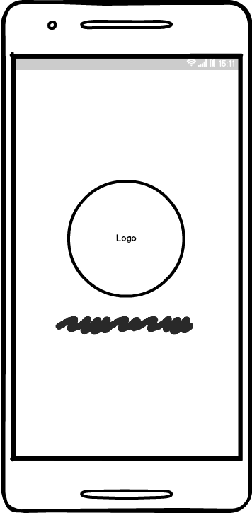
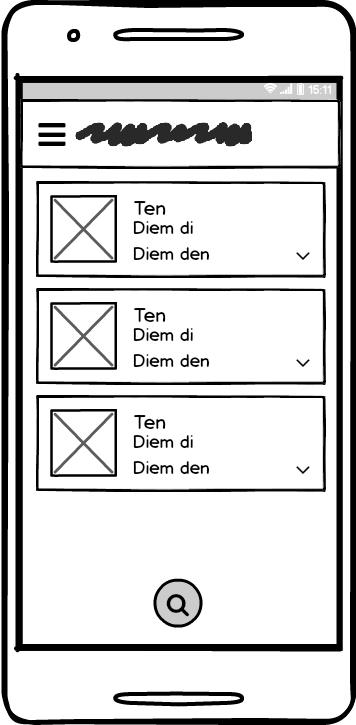
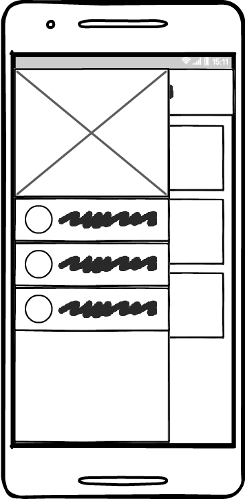
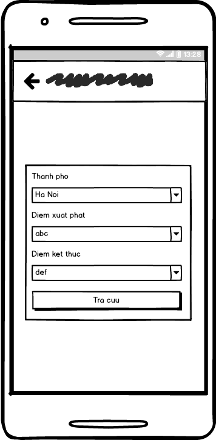
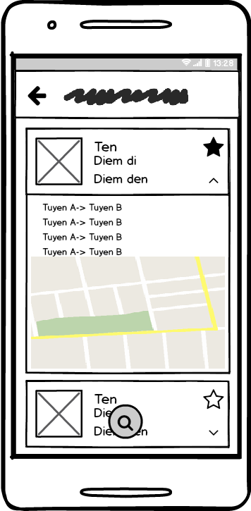
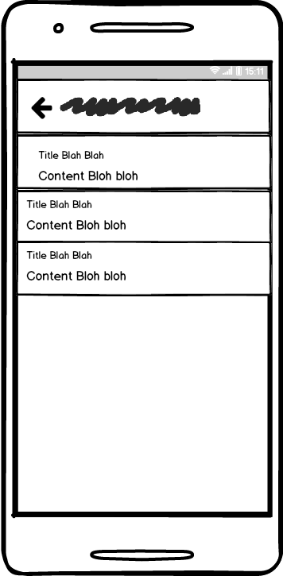

# Dự án I: Lập trình Android _(Updating)_

- Tên dự án: Tìm Xe Bus
- Chủ dự án: Phạm Sỹ Hưng
- Mã sinh viên: PH04930

## I. Giao diện

### 1. Màn hình khởi động (Splash Screen)
- [ ] Hiển thị logo, tiêu đề app

### 2. Màn hình chính (Tuyến đã lưu)
- [ ] Thanh tiêu đề hiển thị icon app nhỏ và tên app
- [ ] Hiển thị danh sách các tuyến xe bus đã lưu
	- [ ] Trượt một tuyến sang bên phải sẽ hiển thị nút **xóa**
	- [ ] Ấn chọn xóa sẽ hiển thị dialog confirm
- [ ] Nút tìm kiếm (tra cứu) xe bus
- [ ] Sidebar gồm các  sub-menu sau
	- [ ] Tuyến đã lưu
	- [ ] Tra cứu
	- [ ] Thông tin ứng dụng

### 3. Màn hình tra cứu 
- [ ] Thanh tiêu đề hiển thị icon app nhỏ và tên app, nút back
- [ ] Form nhỏ chính giữa
	- [ ] Ô nhập/chọn thành phố
	- [ ] Ô nhập/chọn điểm đi
	- [ ] Ô nhập/chọn điểm đến
	- [ ] Nút tìm kiếm
- [ ] _\(Optional)_ hiển thị nút chuyển đổi giữa tra cứu bằng maps và bằng form nhập

### 4. Màn hình kết quả
- [ ] Thanh tiêu đề hiển thị icon app nhỏ và tên app, nút back
- [ ] Hiển thị kết quả (các) lộ trình đi
- [ ] Nút **Yêu thích**(Lưu/Đánh dấu)
- [ ] _\(Optional)_ Ấn vào một lộ trình sẽ hiển thị bản đồ trực quan

### 5. Màn hình thông tin ứng dụng
- [ ] Hiển thị tên ứng dụng, phiên bản, tác giả

## II. Chức năng
- [ ] Tra cứu lộ trình đi (các) chuyến xe bus từ điểm đi và đến
- [ ] Đánh dấu/lưu các lộ trình thường đi
- [ ] Xóa các lộ trình đã lưu
- [ ] _\(Optional)_ Xem lộ trình bằng bản đồ trực quan

## III. Cấu trúc ứng dụng 
- Theo mô hình chuẩn MVP
- [ ] Các model cần tạo:
	- [ ] Tuyến đường ( nhánh nhỏ của một lộ trình ): Mã, thành phố, điểm đi, điểm đến
	- [ ] Xe bus: Mã xe, Số xe, thành phố, lộ trình đi ( list các tuyến đường )
	- [ ] Quản lí xe bus : list các xe bus
	- [ ] Danh sách đánh dấu : list các xe bus
- [ ] Các adapter cho: danh sách tuyến đường, danh sách kết quả, danh sách đã lưu
- [ ] Class Util chứa các phương thức hay dùng
- [ ] Assets: icon, logo app, ảnh,...

## IV. Mockups
_Sử dụng Balsamiq Mockups 3.5.15_
Link file save mockups: [here](mocks/mockups.bmpr)

## V. Sản phẩm hoàn thiện
_Coming soon_
