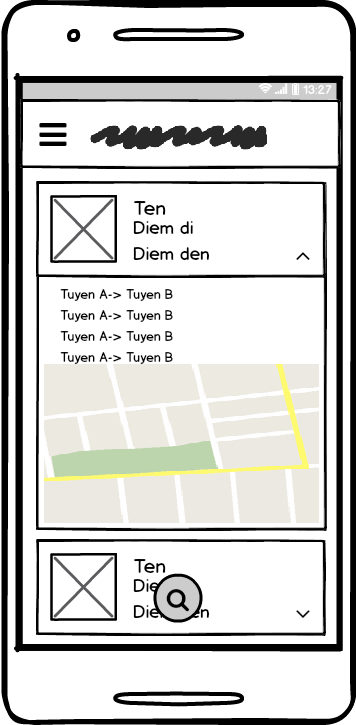
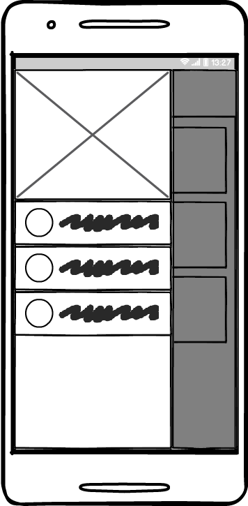
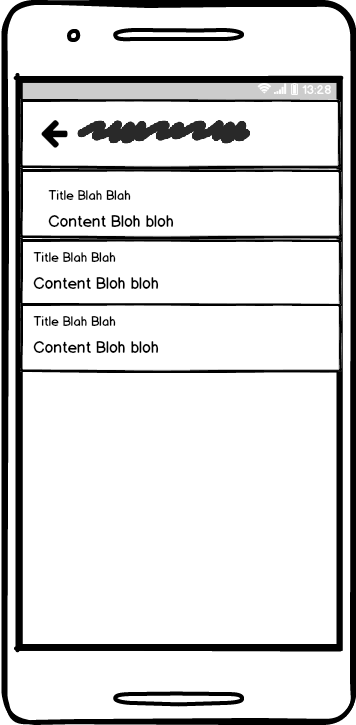

# Dự án I: Lập trình Android

- Tên dự án: Tìm Xe Bus
- Ngôn ngữ: Kotlin
- Chủ dự án: Phạm Sỹ Hưng
- Mã sinh viên: PH04930

## I. Giao diện

### 1. Màn hình khởi động (Splash Screen)
- [x] Hiển thị logo
- [x] Sau 3 giây chuyển sang màn hình chính
### 2. Màn hình chính (Tuyến đã lưu)
- [x] Thanh tiêu đề hiển thị tên app, menu drawer
- [x] Hiển thị danh sách các tuyến xe bus đã lưu, ấn vào sẽ hiển thị chi tiết thông tin tuyến
	- [x] Ấn nút xóa sẽ có dialog confirm
	- [x] Ấn nút đổi tên sẽ hiện dialog hiện ô nhập trên
- [x] Nút tìm kiếm (tra cứu) xe bus
- [x] Sidebar gồm các  sub-menu sau
	- [x] Tuyến đã lưu
	- [x] Tra cứu
	- [x] Thông tin ứng dụng

### 3. Màn hình tra cứu 
- [x] Thanh tiêu đề hiển thị tên app, nút back
- [x] Form nhỏ chính giữa
	- [x] Ô nhập điểm đi
	- [x] Ô nhập điểm đến
	- [x] Nút tìm kiếm
- [ ] _\(Optional)_ hiển thị nút chuyển đổi giữa tra cứu bằng maps và bằng form nhập

### 4. Màn hình kết quả
- [x] Thanh tiêu đề hiển thị tên app, nút back
- [x] Hiển thị kết quả (các) lộ trình đi
- [x] Nút **Yêu thích**(Lưu/Đánh dấu)
- [ ] _\(Optional)_ Ấn vào một lộ trình sẽ hiển thị bản đồ trực quan

### 5. Màn hình thông tin ứng dụng
- [x] Thanh tiêu đề hiển thị tên app, nút back
- [x] Hiển thị tên ứng dụng, phiên bản, tác giả

## II. Chức năng
- [x] Tra cứu lộ trình đi (các) chuyến xe bus từ điểm đi và đến
- [x] Đánh dấu/lưu các lộ trình thường đi
- [x] Xóa các lộ trình đã lưu
- [x] Đổi tên lộ trình đã lưu
- [ ] _\(Optional)_ Xem lộ trình bằng bản đồ trực quan

## III. Cấu trúc ứng dụng 
- Theo mô hình MVP
- [x] Các model cần tạo:
	- [x] Route
	- [x] Block, WalkBlock, BusBlock
	- [x] Bus
- [x] Các adapter cho: Route, Block, Block Detail
- [x] Class Util chứa các phương thức hay dùng
- [x] Assets: icon, logo app, ảnh,...

## IV. Mockups
_Sử dụng Balsamiq Mockups 3.5.15_

Link file save mockups: [here](mocks/mockups.bmpr)

## V. Prototype

